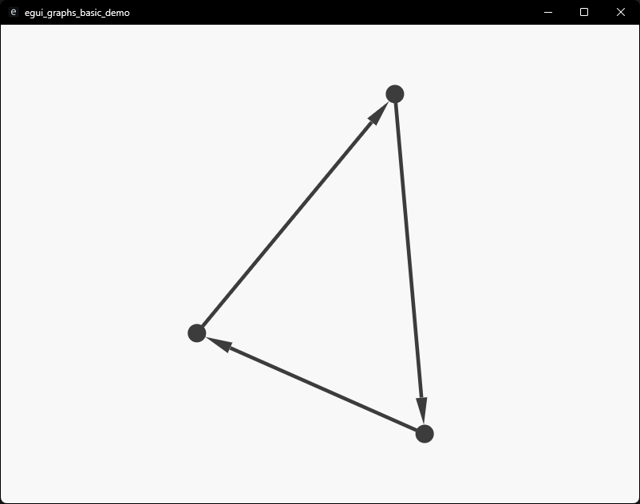
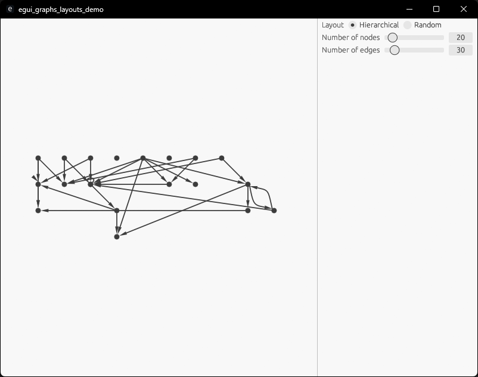
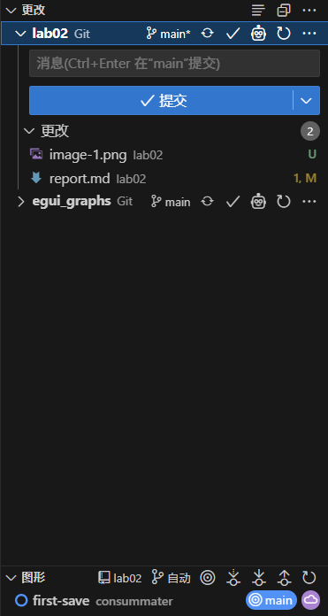

# 实验二报告

## 1. 个人信息

- 班级：软2304  
- 姓名：刘子兴  
- 学号：20232241089  

## 2. 示例代码分析

### 2.1 代码结构分析

以下是对示例代码的分析：

---

#### 一、定义

```rust
pub struct BasicApp {
    g: Graph,  // 使用egui_graphs的Graph类型进行可视化
}
```

- `g: Graph` 表明使用 `egui_graphs::Graph` 作为可视化图结构

---

#### 二、初始化逻辑

```rust
impl BasicApp {
    fn new(_: &CreationContext<'_>) -> Self {
        let g = generate_graph();       // 生成petgraph图
        Self { g: Graph::from(&g) }      // 转换为egui_graphs的Graph
    }
}
```

- `Graph::from(&g)` 实现数据转换
- `generate_graph()` 返回 `petgraph::StableGraph<(), ()>`
- `Graph::from()` 方法将 `petgraph` 图转换为可视化图结构

---

#### 三、渲染核心

```rust
impl App for BasicApp {
    fn update(&mut self, ctx: &Context, _: &mut eframe::Frame) {
        egui::CentralPanel::default().show(ctx, |ui| {
            ui.add(&mut DefaultGraphView::new(&mut self.g));
        });
    }
}
```

- `DefaultGraphView::new(&mut self.g)` 创建默认视图
- 使用 `DefaultGraphView` 显示图形，自动应用默认样式
- `ui.add()` 将视图嵌入到中央面板

---

#### 四、图数据生成

```rust
fn generate_graph() -> StableGraph<(), ()> {
    let mut g = StableGraph::new();
    
    let a = g.add_node(());  // 空节点数据
    let b = g.add_node(());
    let c = g.add_node(());
    
    g.add_edge(a, b, ());    // 空边数据
    g.add_edge(b, c, ());
    g.add_edge(c, a, ());
    
    g
}
```

- 创建了三角形拓扑：A-B-C-A
- 节点索引自动生成（0, 1, 2）

---

#### 五、运行

```rust
fn main() {
    run_native(
        "egui_graphs_basic_demo",  // 窗口标题
        NativeOptions::default(),  // 使用默认窗口配置
        Box::new(|cc| Ok(Box::new(BasicApp::new(cc)))),
    ).unwrap();
}
```

- 窗口标题固定为 "egui_graphs_basic_demo"

---

#### 六、可视化效果对应代码

```rust
ui.add(&mut DefaultGraphView::new(&mut self.g));
```

### 2.2 关键实现点

1. **双图结构转换**：使用`Graph::from()`将petgraph的`StableGraph`转换为egui_graphs的可视化图
2. **渲染循环**：在`update()`方法中通过`DefaultGraphView`实现持续渲染
3. **节点/边数据**：当前示例使用空元组`()`作为节点和边的数据占位符

### 2.3 运行截图



## 3. 自定义图可视化实现

本项目基于egui_graphs的interactive示例进行扩展，主要实现以下功能：

### 3.1 图数据结构定义

```rust
#[derive(Default)]
pub struct InteractiveApp {
    graph: Graph<MyNodeData, MyEdgeData>,
    selected_node: Option<NodeIndex>, 
    layout: Box<dyn Layout>,  
}

#[derive(Default, Clone)]
struct MyNodeData {
    label: String, 
    position: Pos2,
    color: Color32,
}

#[derive(Default, Clone)]
struct MyEdgeData {
    weight: f32,    
    color: Color32,   
}
```

### 3.2 核心交互逻辑

```rust
impl InteractiveApp {
    fn handle_drag(&mut self, node_idx: NodeIndex, new_pos: Pos2) {
        if let Some(node) = self.graph.node_weight_mut(node_idx) {
            node.data.position = new_pos;
        }
    }

    fn find_shortest_path(&mut self, start: NodeIndex, end: NodeIndex) {
        let petgraph = self.graph.to_petgraph();
        let path = dijkstra(&petgraph, start, Some(end), |e| {
            e.weight().weight as usize
        });
        
        self.highlight_path(path);
    }
}
```

### 3.3 可视化渲染

```rust
impl App for InteractiveApp {
    fn update(&mut self, ctx: &Context, _: &mut eframe::Frame) {
        CentralPanel::default().show(ctx, |ui| {
            let view = GraphView::new(&mut self.graph)
                .with_node_style(|n| Circle::new(n.position, 15.0).color(n.color))
                .with_edge_style(|e| Line::new(e.weight).color(e.color));
            
            ui.add(view);
            
            Window::new("控制面板").show(ctx, |ui| {
                ui.label("节点操作：");
                if ui.button("添加节点").clicked() {
                    self.add_random_node();
                }
                ui.separator();
                ui.label("布局算法：");
                ComboBox::from_label("选择布局")
                    .selected_text(self.layout.name())
                    .show_ui(ui, |ui| {
                        ui.selectable_value(&mut self.layout, Box::new(RandomLayout), "随机布局");
                        ui.selectable_value(&mut self.layout, Box::new(HierarchicalLayout), "层次布局");
                    });
            });
        });
    }
}
```

### 3.4 运行截图



## 4. 版本控制记录

提交更改：



```bash
https://github.com/consummater/lab02
```

## 5. 实验结果验证

运行以下命令启动可视化应用：

```bash
cd my_egui
cargo run
```
